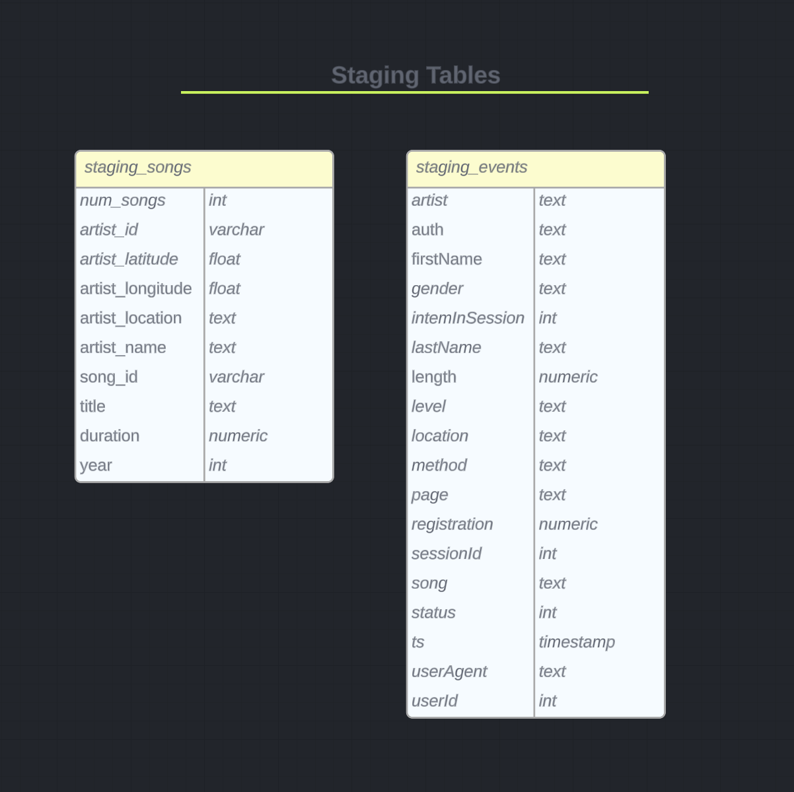

# Data Warehouse project - Song app
This project involves transforming JSON files from Amazon S3 into a star schema in Amazon Redshift. It is designed to support a music streaming startup called Sparkify, which has experienced significant growth in its user base and song database. To optimize their data processing and analytics, they have decided to migrate their data to the cloud.

## Raw Json File 
The source data is stored in S3 and consists of two types of JSON files:
 - **staging_songs**: Contains metadata about songs and their respective artists. These files are partitioned by the first three letters of each song's track ID. For example:
     ```
    song_data/A/B/C/TRABCEI128F424C983.json
    song_data/A/A/B/TRAABJL12903CDCF1A.json
    ```

- **staging_events**: Contains activity logs from the music streaming app. The log files are partitioned by year and month, and the JSON path for the staging_events table is defined in `log_json_path.json`. For example:
    ```
    log_data/2018/11/2018-11-12-events.json
    log_data/2018/11/2018-11-13-events.json
    ```


## Star Schema
The ETL process in this project creates a star schema optimized for song play analysis. The schema includes the following tables:
- Fact Table:
    - songplays

- Dimension Tables:
    - users
    - songs
    - artists
    - time


## How to run
To set up and run this project, follow these steps:
### Configurations 
1. Clone this repository and make sure you have access to the S3 bucket where your data is stored.

2. Update the cluster configuration in `dwh.cfg` with your own Amazon Redshift cluster details:
    ```python
    [CLUSTER]
    HOST=
    DB_NAME=
    DB_USER=
    DB_PASSWORD=
    DB_PORT=
    ```
### Creating Tables
Run the following command in your terminal to create the required tables
```
    run create_tables.py
```
### Load Data 
Load the data S3 to the staging tables and from staging tables into the star schema tables by running:
```
    run etl.py
```
### Analytics query Sample
o run sample analytics queries and check the number of records in your tables, execute:
```
    run analytics.py
```

Now your data warehouse is ready for analysis.

Feel free to reach out if you have any questions or encounter any issues. Enjoy analyzing your music streaming data!
